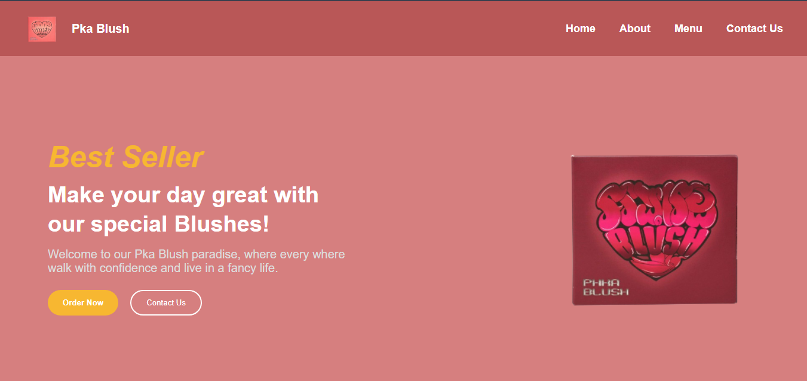
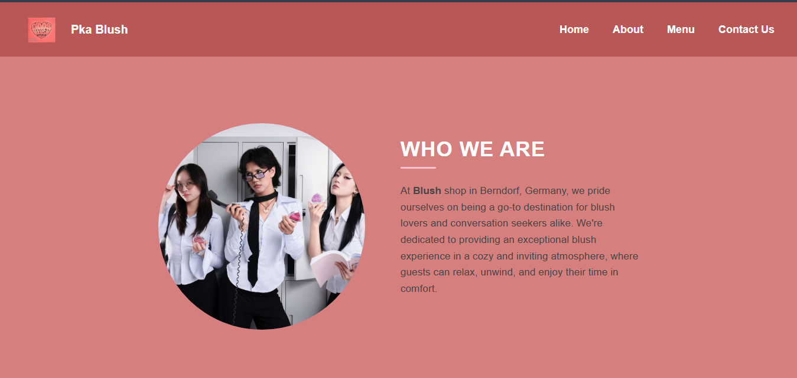
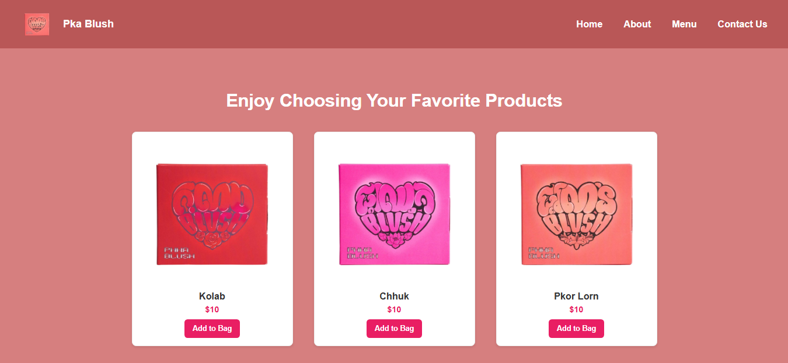
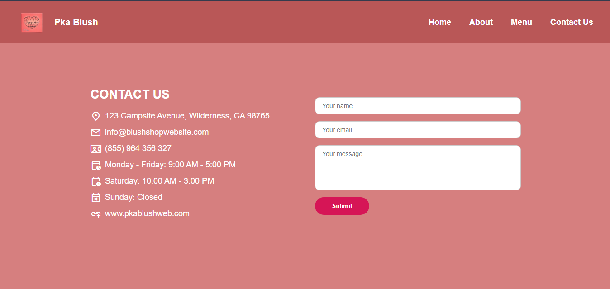

# 🌸 Pka Blush 

The Pka Blush is an website where you can find a creative multi-use cosmetic product, seemingly inspired by the Khmer word for "flower" or "blossom." It's sold by the Cambodian brand Pich Pisey and appears in a compact, heart-shaped design.
Pka Blush seems perfect for those looking for a budget-friendly, travel-savvy, and versatile makeup item, especially if you appreciate Cambodian-inspired names and design aesthetics.

## 📦 Installation Guide

1. **Unpack the Product**

    + Open the compact container.

    + Make sure your face and hands are clean.

2. **Prepare Your Face**

    + Apply foundation or base makeup if needed.

    + Ensure your skin is moisturized for smooth blending.

3. **Blush Installation (Cheeks)**

    + Use a brush or your fingertip.

    + Gently dab the product on the apples of your cheeks.

    + Blend outward in a circular motion.

4. **Lip Installation (Tint)**

    + Use your fingertip or a lip brush.

    + Apply a small amount to the center of your lips.

    + Blend evenly for a natural look

5. **Eyeshadow Installation (Eyelids)**

    + Dab a small amount onto your eyelids.

    + Blend with your finger or eyeshadow brush.

    + Add more layers if you want a bolder look.

##  👥 Team Members

    1. Dane Miok

    2. Sophea Sophorn

    3. Visa Sak

## 📎 Deployed Link

##  Screenshots (Optional)

Home Page

About Page

Menu Page

Contact Page
